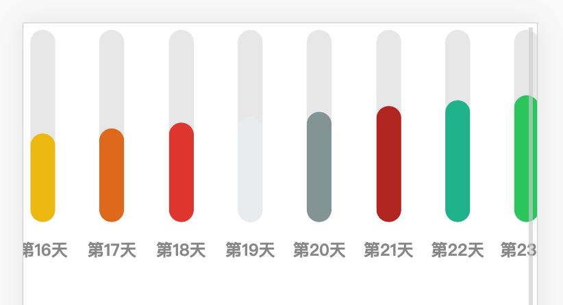

# vue-column-chart

> Column chart in vue.

## screenshot



## usage

```vue
<template>
  <div class="chart">
    <chart :items="items"/>
  </div>
</template>

<script>
import Chart from "./Chart";

export default {
  components: { Chart },
  data: function() {
    const items = [];
    const colors = [
      "#1abc9c",
      "#2ecc71",
      "#3498db",
      "#9b59b6",
      "#34495e",
      "#f1c40f",
      "#e67e22",
      "#e74c3c",
      "#ecf0f1",
      "#95a5a6",
      "#c0392b"
    ];
    for (let i = 0; i < 30; i++) {
      items.push({
        value: i,
        color: "red",
        title: "第" + i + "天",
        color: colors[i % colors.length]
      });
    }
    return {
      items
    };
  }
};
</script>

<style scoped>
.chart {
  width: 2500px;
}
</style>

```